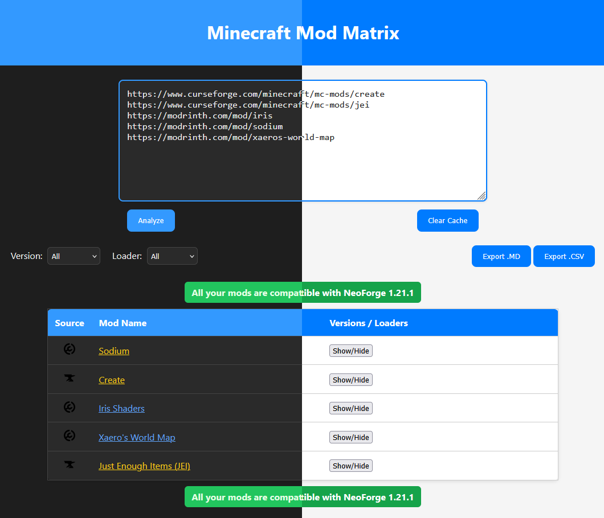

# Whaaaam

**Whaaaam** tells you what Minecraft version and mod loader all your mods have in common.

Paste your CurseForge and Modrinth mod URLs, and instantly see which Minecraft versions and loaders (Forge, Fabric, NeoForge, Quilt) are compatible across your entire mod list.

## Features

- **Multi-Source Support** - Works with both CurseForge and Modrinth URLs
- **Compatibility Analysis** - Instantly finds common versions/loaders across all mods
- **Dual Interface** - Use via CLI or web browser
- **Smart Filtering** - Filter results by Minecraft version or mod loader
- **Export Options** - Download your mod list as Markdown or CSV
- **Beautiful Themes** - 4 Catppuccin themes (Latte, Frappé, Macchiato, Mocha) with smooth transitions
- **Caching** - Fast repeated lookups with local cache

## Quick Start

### Prerequisites

- Python 3.8+
- pip
- Node.js 16+ and npm (for building frontend assets)

### Installation

```bash
# Clone the repository
git clone https://github.com/Lord-ZuzurNC/Whaaaam.git
cd Whaaaam

# Install Python dependencies
pip install -r requirements.txt

# Install Node.js dependencies and build CSS
npm install
npm run build:css
```

### Usage

#### Web Interface (Recommended)

```bash
python web.py
```

Open your browser to `http://localhost:5000`, paste your mod URLs (one per line), and click **Analyze**.

#### Command Line

```bash
python main.py
```

Enter your mod URLs one per line, then press Enter on an empty line to analyze.

## How It Works

1. **Paste URLs** - Add CurseForge or Modrinth mod page URLs
2. **Analyze** - Whaaaam fetches version data from each platform's API
3. **Compare** - All mod versions are cross-referenced to find common compatibility
4. **Results** - See which Minecraft versions and loaders work with ALL your mods

### Example Output

```text
All your mods are compatible with Fabric 1.20.1 & Forge 1.20.1
```

Or if there's partial compatibility:

```text
Most of your mods share: Fabric 1.20.1 (8/10)
```

## Supported Platforms

| Platform   | URL Format                                              |
|------------|---------------------------------------------------------|
| CurseForge | `https://www.curseforge.com/minecraft/mc-mods/mod-name` |
| Modrinth   | `https://modrinth.com/mod/mod-name`                     |

## Theme System

Whaaaam features 4 beautiful Catppuccin color themes that you can switch between seamlessly:

- **Latte** - Light theme with warm, cozy colors
- **Frappé** - Cool dark theme with subtle purple tones
- **Macchiato** - Darker theme with rich, saturated colors
- **Mocha** - Deep dark theme, perfect for late-night sessions (default)



Themes are automatically saved to your browser and can be shared via URL (e.g., `?theme=latte`).

### For Developers

The theme system is built with:
- **TailwindCSS v3** - Utility-first CSS framework with JIT compilation
- **Catppuccin Colors** - All 4 palettes (68 colors total) available as Tailwind utilities
- **ThemeManager API** - JavaScript module for programmatic theme control
- **URL Parameters** - Share themes via `?theme=<name>` in the URL

To customize or extend themes, see the [Development](#development) section below.

## Configuration

No configuration required! Whaaaam works out of the box.

### Environment Variables

| Variable     | Description                                           | Default |
|--------------|-------------------------------------------------------|---------|
| `CF_API_KEY` | CurseForge API key (optional, for higher rate limits) | None    |

## Development

### Building Frontend Assets

Whaaaam uses TailwindCSS for styling. After making changes to HTML templates or JavaScript:

```bash
# Build optimized CSS (for production)
npm run build:css

# Watch mode (rebuilds automatically on file changes)
npm run watch:css
```

The build process:
1. Reads Tailwind directives from `src/input.css`
2. Scans `templates/**/*.html` and `static/**/*.js` for class usage
3. Generates minified CSS to `static/css/tailwind.css`

### Theme System Architecture

**Configuration** (`tailwind.config.js`):
- Defines 4 Catppuccin color palettes (latte, frappe, macchiato, mocha)
- Each palette has 17 colors (5 base + 12 accent colors)
- Colors available as Tailwind utilities: `bg-mocha-base`, `text-latte-text`, etc.

**JavaScript** (`static/app.js`):
- `ThemeManager` module with IIFE pattern for encapsulation
- Public API: `setTheme(name)`, `getTheme()`, `initTheme()`
- Handles localStorage persistence and URL parameter sync
- Priority: URL param > localStorage > default ("mocha")

**CSS** (`static/styles.css` + `static/css/tailwind.css`):
- Dual-loading pattern: legacy CSS first, Tailwind CSS second
- Smooth 0.5s transitions when switching themes
- Backward compatible with existing `body.dark` class

**HTML** (`templates/index.html`):
- Theme attribute on `<html data-theme="mocha">`
- Circular theme switcher with ARIA roles for accessibility
- Keyboard navigation support (arrow keys)

### CSS Migration Status

The project is currently in a **gradual migration** from custom CSS to TailwindCSS:

- **Phase 1: Dual Loading** ✅ Complete
  - Both `styles.css` (legacy) and `tailwind.css` (new) are loaded
  - New system has override priority

- **Phase 2: Component Migration** 🚧 In Progress
  - Migrating components incrementally to Tailwind utilities
  - Legacy CSS marked with `/* LEGACY: ... */` comments

- **Phase 3: Cleanup** 📋 Planned
  - Remove legacy CSS once all components are migrated
  - Remove dual-loading system

See `.ralph-tui/MIGRATION_CHECKLIST.md` for detailed migration tracking.

## Contributing

We welcome contributions! Please see [CONTRIBUTING.md](CONTRIBUTING.md) for guidelines.

## Security

For security vulnerabilities, please see [SECURITY.md](SECURITY.md).

## License

This project is licensed under the MIT License - see the [LICENSE](LICENSE) file for details.

## Acknowledgments

- Thanks to the [CurseForge](https://www.curseforge.com/) and [Modrinth](https://modrinth.com/) teams for their APIs
- Built with [Flask](https://flask.palletsprojects.com/) and love

---

Made with love by [Lord_ZuzurNC](https://github.com/Lord-ZuzurNC)
