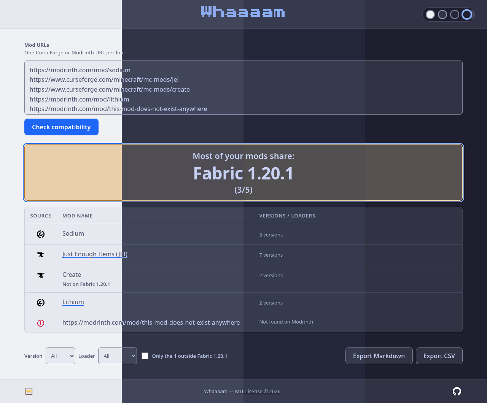
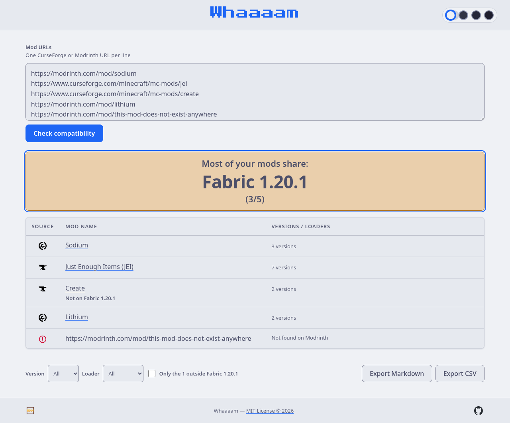
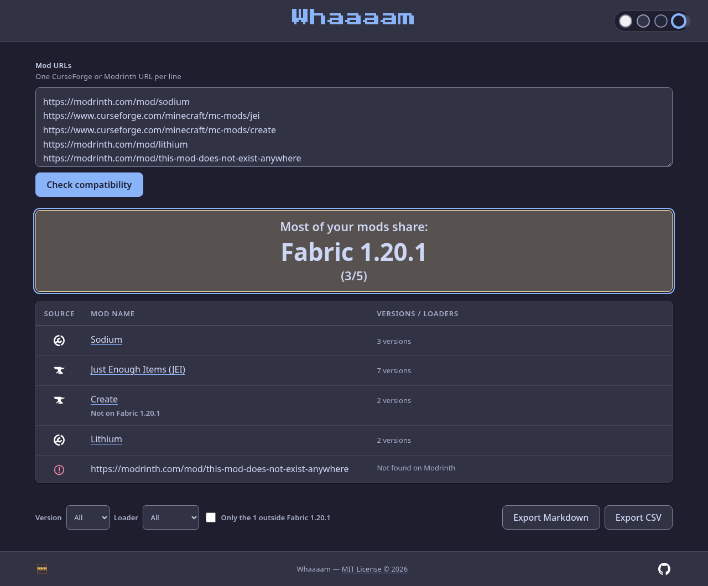

# Whaaaam

**Whaaaam** tells you what Minecraft version and mod loader all your mods have in common.

Paste your CurseForge and Modrinth mod URLs, and see which Minecraft versions and loaders (Forge, Fabric, NeoForge, Quilt) your entire mod list agrees on — or, when it doesn't fully agree, what most of it shares and which mods fall outside.



## Features

- **Multi-Source Support** - Works with both CurseForge and Modrinth URLs, mixed freely
- **Compatibility Analysis** - Finds the versions and loaders common to the whole list, or the largest consensus with a count (`8/10`)
- **Nothing Silently Dropped** - A mod that could not be checked stays in the results with the reason, and still counts
- **Dual Interface** - Use via CLI or web browser; both give the same answer in the same words
- **Smart Filtering** - Filter results by Minecraft version or mod loader without changing the verdict
- **Export Options** - Download your mod list as Markdown or CSV
- **Four Themes** - The Catppuccin palettes: Latte, Frappé, Macchiato, Mocha
- **Caching** - Version data is cached on disk for 24 hours, so a re-check is fast

## Quick Start

### Prerequisites

- Git
- Python 3.10 or newer, with `venv` and `pip`

```bash
apt install -y git python3 python3-venv python3-pip
```

### Installation

```bash
# Clone the repository
git clone https://github.com/Lord-ZuzurNC/Whaaaam.git
cd Whaaaam

# Create a virtual environment and install the dependencies
python3 -m venv .venv
source .venv/bin/activate
pip install --upgrade pip
pip install -r requirements.txt

# Settings: then put your CurseForge API key in .env (leave it empty for
# Modrinth-only lists)
cp .env.example .env
```

- A CurseForge API key, if you check CurseForge mods — request one at [console.curseforge.com](https://console.curseforge.com/). Modrinth needs none.

Without a key the app still runs: Modrinth mods check normally and each
CurseForge URL is listed as could not be checked, with the reason — see
[Configuration](#configuration).

### Usage

#### Web Interface (Recommended)

```bash
python web.py
```

Open your browser to `http://localhost:5000`, paste your mod URLs (one per line), and click **Check compatibility**. The verdict appears first; the per-mod table, filters and exports sit underneath it.

`web.py` binds `127.0.0.1` and starts Flask's development server. Set `HOST` and
`PORT` in `.env` (or the environment) to move it, but do not expose that server directly — it has no
request-size or slow-client protection of its own.

#### Command Line

The CLI gives the same answer as the web UI — same checking, same verdict, same wording.

```bash
# URLs as arguments
python main.py https://modrinth.com/mod/sodium https://www.curseforge.com/minecraft/mc-mods/jei

# from a file, or piped in
python main.py --file mods.txt
cat mods.txt | python main.py

# or paste interactively: run with no arguments, blank line to finish
python main.py
```

| Option             | What it does                                       |
| ------------------ | -------------------------------------------------- |
| `-h`, `--help`     | show every option, exit codes and examples         |
| `-f`, `--file`     | read URLs from a file, one per line                |
| `--version 1.20.1` | only show table rows for that Minecraft version    |
| `--loader fabric`  | only show table rows for that loader               |
| `--show-versions`  | list every version instead of a count              |
| `--export md\|csv` | write the results to a file (`--out -` for stdout) |
| `--clear-cache`    | delete the cached version data and exit            |

Filters narrow the table; they never change the verdict above it. Exit status, so
it composes into scripts:

| Status | Meaning                                                               |
| ------ | --------------------------------------------------------------------- |
| `0`    | the list shares a version (fully, or as a majority consensus)         |
| `1`    | no URLs were given, or some mods were not fetched before the deadline |
| `2`    | the list shares no version, or nothing could be checked               |

Set `NO_COLOR` to turn off the coloured verdict.

## How It Works

1. **Paste URLs** - Add CurseForge or Modrinth mod page URLs
2. **Check** - Whaaaam fetches version data from each platform's API, eight mods at a time
3. **Compare** - All mod versions are cross-referenced to find common compatibility
4. **Results** - See which Minecraft versions and loaders work with ALL your mods.
   Mods that could not be fetched are listed with the reason and still counted, so
   a green verdict always means the whole list was checked.

### Example Output

```text
All your mods are compatible with Fabric 1.20.1 & Forge 1.20.1
```

Or if there's partial compatibility:

```text
Most of your mods share: Fabric 1.20.1 (8/10)
```

## Supported Platforms

| Platform   | URL Format                                              |
| ---------- | ------------------------------------------------------- |
| CurseForge | `https://www.curseforge.com/minecraft/mc-mods/mod-name` |
| Modrinth   | `https://modrinth.com/mod/mod-name`                     |

Anything else is reported as "Not a CurseForge or Modrinth link" rather than fetched.

## Deployment

Every CurseForge mod checked spends your `CF_API_KEY`, and every check spends
server time and upstream requests, so a reachable instance needs a limit in
front of it. Run under a real WSGI server:

```bash
gunicorn -w 4 --threads 8 -b 127.0.0.1:5000 --timeout 60 web:app
```

`--threads` matters: a check is long and I/O-bound, and with the default sync
worker one slow request occupies a whole worker. With four sync workers, four
requests were enough to make the service unavailable to everyone else.

Rate-limiting belongs at the reverse proxy, which is the only place that sees
every worker's traffic. A working configuration is committed at
[`deploy/nginx.conf`](deploy/nginx.conf) — it is a file rather than a snippet in
this README because a limit described in prose enforces nothing. Set its
`server_name` and point your ACME client at it for the TLS certificate.

As committed, it allows each client address 10 checks a minute with a burst of
5 and 8 open connections; loading the page itself is not limited. A client over
the limit gets HTTP 429, which the page words as "Too many checks from your
connection. Wait a moment, then check again." Tune `rate` in the file to taste.
Without that proxy — running `web.py` or gunicorn directly — there is no
per-caller limit at all.

The app bounds a single request on its own: 256 KB of body, 200 URLs, and a 45
second deadline after which unfinished mods come back as rows saying so. Those
are per-request; only the proxy can cap requests per caller. Keep the proxy's
`proxy_read_timeout` above the app's deadline so the app returns its own partial
answer instead of the proxy cutting the connection.

The response cache lives in `cache/` next to the code, is capped at 256 MB
(`CACHE_MAX_BYTES`) and evicts oldest-first. Give it a bounded volume anyway so a
full disk cannot take the host down with it. Clearing it is an operator action —
the web page deliberately has no button for it, since any visitor could wipe it:

```bash
python main.py --clear-cache
```

## Theme System

Whaaaam ships the four Catppuccin palettes; the switcher sits in the page header.

- **Latte** - Light theme
- **Frappé** - Muted dark theme
- **Macchiato** - Darker theme
- **Mocha** - Deepest dark theme (default)

| Latte                                                    | Mocha                                                   |
| -------------------------------------------------------- | ------------------------------------------------------- |
|  |  |

Your choice is saved in the browser and can be shared via URL (e.g., `?theme=latte`).

### For Developers

The theme system is built with:
- **CSS custom properties** - one `[data-theme]` block per palette in `static/styles.css`
- **Catppuccin Colors** - all 4 palettes, mapped to semantic roles rather than raw swatches
- **ThemeManager API** - JavaScript module for programmatic theme control
- **URL Parameters** - Share themes via `?theme=<name>` in the URL

To customize or extend themes, see the [Development](#development) section below.

## Configuration

### Environment Variables

| Variable     | Description                                   | Default     |
| ------------ | --------------------------------------------- | ----------- |
| `CF_API_KEY` | CurseForge API key, for CurseForge mods only  | None        |
| `HOST`       | address `python web.py` binds to              | `127.0.0.1` |
| `PORT`       | port `python web.py` listens on               | `5000`      |
| `NO_COLOR`   | any value turns off the CLI's coloured output | unset       |

`CF_API_KEY` is read only when a CurseForge mod is checked, never at startup.
Without it, a Modrinth-only list works normally and each CurseForge URL comes
back as a row reading "This server has no CurseForge API key (CF_API_KEY), so
CurseForge mods cannot be checked; Modrinth links still work" — counted in the verdict like any other mod
that could not be checked, and no request is sent to CurseForge. Set it in your
environment or in a `.env` file.

All four can go in a `.env` file next to the code; `cp .env.example .env` gives
you a commented starting point. A variable already set in the environment wins
over `.env`. `.env` is git-ignored; keep it that way. `HOST` and `PORT` only
apply to `python web.py` — under gunicorn, the `-b` flag decides.

## Development

### Tests

Run both before committing. Neither makes a network request, and neither needs a
real API key.

```bash
python test_compat.py   # verdict logic, and CLI/web parity: runs static/app.js under Node
python test_web.py      # the HTTP edge: input limits, host matching, error copy, headers, cache
```

`test_compat.py` needs `node` on your `PATH` for its parity half. CI runs both on
Python 3.10, 3.12 and 3.13.

### Frontend

`static/styles.css` is authored by hand and served as-is. There is no build step,
no bundler and no CSS framework — edit the file and reload.

The design system it implements (tokens, type scale, components, named rules) is
documented in [DESIGN.md](DESIGN.md).

### Theme System Architecture

**Tokens** (`static/styles.css`, section 1):
- One `[data-theme="..."]` block per palette: latte, frappe, macchiato, mocha
- Each defines the same 18 semantic properties — `--bg`, `--surface`, `--line`,
  `--border`, `--text`, `--subtext`, `--accent`, `--on-accent`, the verdict
  statuses, and so on
- Components read tokens; they never hard-code a colour
- A Mocha-valued `:root` fallback sits **above** the theme blocks, because
  `:root` and `[data-theme="x"]` share specificity and source order decides

**JavaScript**:
- `static/theme-init.js` runs in `<head>` and sets the theme before first paint,
  so a Latte user never sees a dark flash
- `static/app.js` holds the `ThemeManager` module, with the public API
  `setTheme(name)`, `getTheme()`, `initTheme()`
- It handles localStorage persistence and URL parameter sync
- Priority: URL param > localStorage > default ("mocha")

**HTML** (`templates/index.html`):
- Theme attribute on `<html data-theme="...">` — the only theme signal
- Circular theme switcher as an ARIA `radiogroup` with roving tabindex
- Keyboard navigation: arrow keys, Home and End

### Accessibility

Every foreground/background pair is verified against WCAG AA in all four palettes.
Latte is the strict one — its accents are mid-lightness, so a colour that passes on
Mocha can fail there. The page has a single live region (`#sr-announce`), a
`prefers-reduced-motion` path, and a `forced-colors` path.

## Contributing

We welcome contributions! Please see [CONTRIBUTING.md](CONTRIBUTING.md) for guidelines.

## Security

For security vulnerabilities, please see [SECURITY.md](SECURITY.md).

## License

This project is licensed under the MIT License - see the [LICENSE](LICENSE) file for details.

## Acknowledgments

- [Mojang Studios](https://www.minecraft.net/) and [Microsoft](https://www.microsoft.com/) for Minecraft, the game all of this exists for.
- [CurseForge](https://www.curseforge.com/) and [Modrinth](https://modrinth.com/) for hosting the mod libraries and for the API access that makes checking them possible.
- [Catppuccin](https://catppuccin.com/) for the Latte, Frappé, Macchiato and Mocha palettes behind the four themes.

Whaaaam is not an official Minecraft product and is not approved by or associated with Mojang or Microsoft.

---

Made with AI by [Lord_ZuzurNC](https://github.com/Lord-ZuzurNC)
